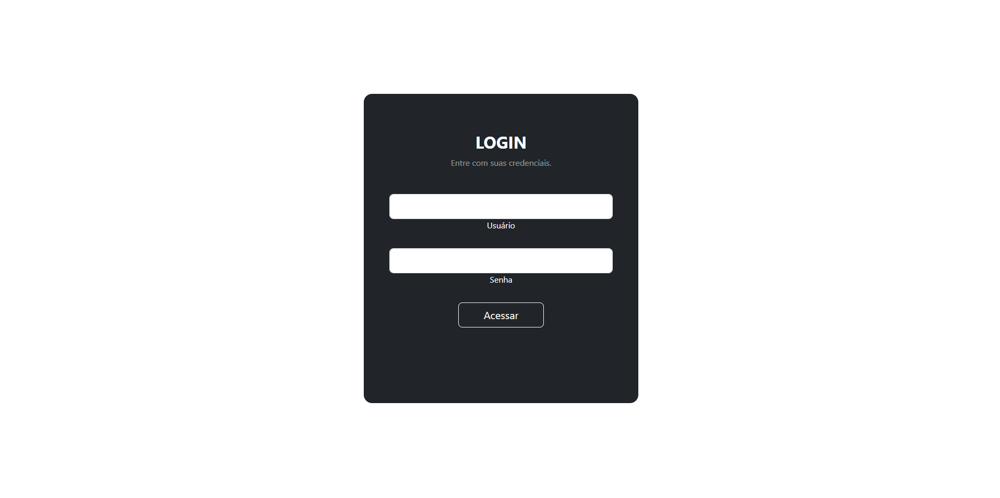

# Sistema simples de login com PHP

- Projeto simples criado em aula com o professor João Ribeiro.
- Na aula foi apresentado como autentificar senhas encryptadas e restringir acesso a páginas onde o usuário desconectado não teria acesso.

## Funcionalidades
- Login
- Validação
- Logout

## Tecnologias
- PHP
- Boostrap

## Requisitos
- Servidor web com suporte a PHP